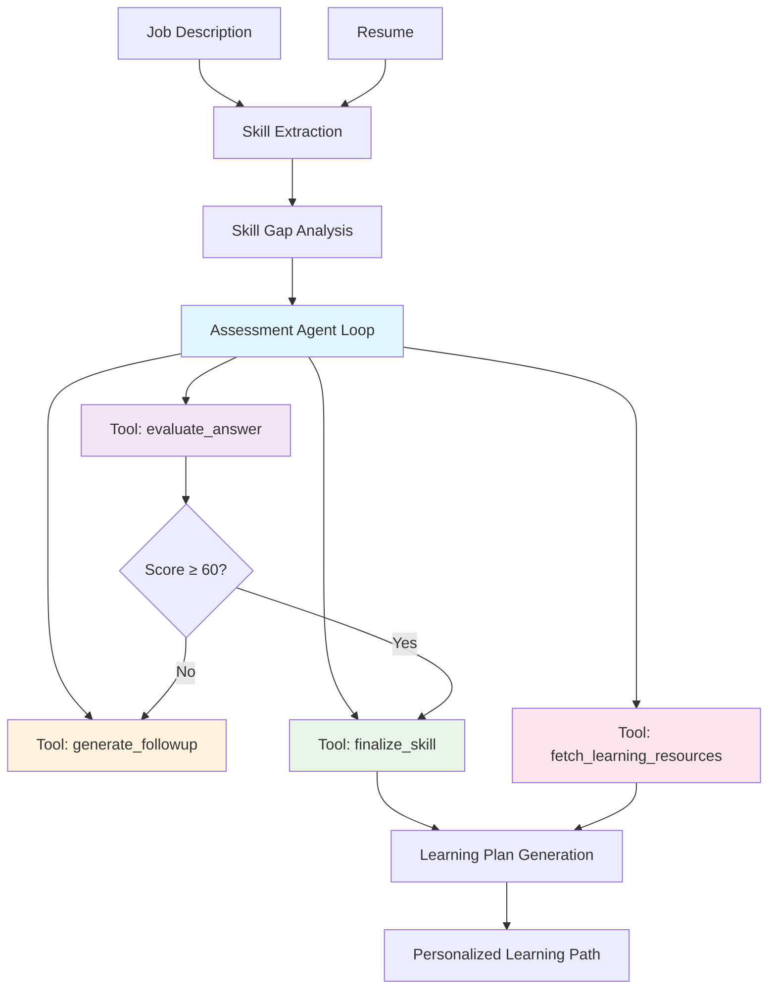

# 🤖 Skill Assessment Agent

AI-powered skill assessment and personalized learning plan generator using Groq's Llama 3.3 model with advanced tool-use capabilities.

[](https://opensource.org/licenses/MIT)
[](https://nodejs.org/)
[](https://reactjs.org/)

## 📋 Table of Contents

- [Overview](#overview)
- [Architecture](#architecture)
- [Features](#features)
- [Tech Stack](#tech-stack)
- [Installation](#installation)
- [Usage](#usage)
- [API Documentation](#api-documentation)
- [Scoring Logic](#scoring-logic)
- [Sample Inputs & Outputs](#sample-inputs--outputs)
- [Contributing](#contributing)

## 🎯 Overview

The Skill Assessment Agent is an intelligent system that evaluates candidates' technical skills against job requirements and generates personalized learning plans. It uses advanced AI agents with tool-use capabilities to conduct conversational assessments and provide detailed feedback.

**Key Capabilities:**
- Extract skills from job descriptions and resumes
- Conduct intelligent skill assessments with follow-up questions
- Generate personalized learning resources and timelines
- Provide detailed scoring (0-100) with proficiency levels

## 🏗️ Architecture



### Core Components

1. **Skill Extraction Engine**: Uses LLM to parse job descriptions and resumes, extracting required skills with proficiency levels and importance scores.

2. **Assessment Agent Loop**: Multi-iteration agent that uses 4 specialized tools:
   - `evaluate_answer`: Scores responses 0-100 with reasoning
   - `generate_followup`: Creates targeted follow-up questions for gaps
   - `finalize_skill`: Completes assessment with comprehensive feedback
   - `fetch_learning_resources`: Generates personalized learning resources

3. **Learning Plan Generator**: Creates structured learning paths with realistic timelines, resource recommendations, and study hour estimates.

### Scoring Logic

- **Score Range**: 0-100 points
- **Proficiency Levels**: beginner, intermediate, advanced
- **Assessment Flow**:
  1. Initial question based on candidate's claimed proficiency
  2. Score evaluation (≥60 = pass, <60 = follow-up needed)
  3. Maximum 2 attempts per skill
  4. Final score determines learning recommendations

## ✨ Features

- **Intelligent Skill Extraction**: Automatically identifies required vs. nice-to-have skills
- **Conversational Assessment**: Natural dialogue with follow-up questions
- **Multi-iteration Agent**: Uses tool-calling for complex decision making
- **Personalized Learning Plans**: Custom resources and timelines based on gaps
- **Real-time Progress Tracking**: Visual progress indicators during assessment
- **Responsive UI**: Modern React interface with smooth animations
- **RESTful API**: Clean endpoints for integration

## 🛠️ Tech Stack

### Backend
- **Node.js** - Runtime environment
- **Express.js** - Web framework
- **Groq SDK** - AI model integration (Llama 3.3-70b-versatile)
- **CORS** - Cross-origin resource sharing

### Frontend
- **React 18** - UI framework
- **Vite** - Build tool and dev server
- **Axios** - HTTP client
- **CSS3** - Modern styling with CSS variables

### AI/ML
- **Groq API** - Fast inference for conversational AI
- **Tool-use Architecture** - Function calling for structured outputs
- **Prompt Engineering** - Carefully crafted prompts for consistent results

## 🚀 Installation

### Prerequisites
- Node.js 18+
- npm or yarn
- Groq API key (get from [groq.com](https://groq.com))

### Setup

1. **Clone the repository**
   ```bash
   git clone https://github.com/nelli-ganesh-reddy/skill-assessment-agent.git
   cd skill-assessment-agent
   ```

2. **Install dependencies**
   ```bash
   npm install
   cd frontend && npm install && cd ..
   ```

3. **Configure environment**
   ```bash
   # Create .env file in root directory
   echo "GROQ_API_KEY=your_groq_api_key_here" > .env
   ```

4. **Start the application**
   ```bash
   # Development mode (both frontend and backend)
   npm run dev

   # Or start individually
   npm start              # Backend only
   cd frontend && npm run dev  # Frontend only
   ```

5. **Access the application**
   - Frontend: http://localhost:5173
   - Backend API: http://localhost:5000

## 📖 Usage

### Web Interface

1. **Upload Documents**: Paste job description and resume text
2. **Start Assessment**: Click "Start Assessment" to begin
3. **Answer Questions**: Respond to skill-specific questions
4. **Review Results**: View detailed scores and learning plans

### API Usage

```javascript
// Start assessment
const response = await fetch('/api/assess', {
  method: 'POST',
  headers: { 'Content-Type': 'application/json' },
  body: JSON.stringify({ jd: jobDescription, resume: resumeText })
});

// Get next question
const question = await fetch(`/api/assess/${sessionId}/next-question`);

// Submit answer
const result = await fetch(`/api/assess/${sessionId}/answer`, {
  method: 'POST',
  headers: { 'Content-Type': 'application/json' },
  body: JSON.stringify({ skill: 'Python', answer: 'My answer...' })
});
```

## 📚 API Documentation

### Endpoints

#### `POST /api/assess`
Initialize a new assessment session.

**Request:**
```json
{
  "jd": "Job description text...",
  "resume": "Resume text..."
}
```

**Response:**
```json
{
  "sessionId": "abc123",
  "jdSkills": { "required_skills": [...], "nice_to_have": [...] },
  "resumeSkills": { "skills": [...] },
  "requiredSkillsCount": 5
}
```

#### `GET /api/assess/:sessionId/next-question`
Get the next skill to assess.

**Response:**
```json
{
  "skillIndex": 2,
  "totalSkills": 5,
  "skill": "Python",
  "question": "Explain how you would implement a REST API in Python...",
  "importance": 0.9,
  "candidateClaimed": "intermediate",
  "jobRequires": "intermediate"
}
```

#### `POST /api/assess/:sessionId/answer`
Submit an answer for assessment.

**Request:**
```json
{
  "skill": "Python",
  "answer": "I would use Flask or FastAPI..."
}
```

**Response (Follow-up needed):**
```json
{
  "status": "followup",
  "skill": "Python",
  "score": 65,
  "reasoning": "Shows basic knowledge but lacks depth",
  "followup_question": "How would you handle authentication in your API?",
  "attemptNumber": 2
}
```

**Response (Skill completed):**
```json
{
  "status": "completed",
  "skill": "Python",
  "score": 85,
  "level": "intermediate",
  "reasoning": "Strong practical knowledge with good understanding",
  "strengths": ["API design", "framework knowledge"],
  "gaps": ["security best practices"],
  "totalAttempts": 2,
  "assessedCount": 3,
  "totalRequired": 5
}
```

#### `GET /api/assess/:sessionId/learning-plan`
Generate personalized learning plan.

**Response:**
```json
{
  "learningPlan": {
    "learning_path": [
      {
        "skill": "Django",
        "priority": "critical",
        "current_level": 40,
        "target_level": 85,
        "weeks_needed": 6,
        "resources": [
          {
            "title": "Django for Beginners",
            "type": "course",
            "url": "https://example.com/django-course",
            "hours": 30,
            "description": "Comprehensive Django introduction"
          }
        ],
        "adjacent_skills": ["REST APIs", "PostgreSQL"]
      }
    ],
    "total_timeline_weeks": 12,
    "estimated_study_hours": 150,
    "can_parallelize": true
  }
}
```

## 🎯 Scoring Logic

### Assessment Flow

1. **Skill Selection**: Agent prioritizes skills by importance and candidate gaps
2. **Question Generation**: Creates contextual questions based on claimed proficiency
3. **Answer Evaluation**:
   - Score 0-100 based on accuracy, depth, and relevance
   - Assign proficiency level (beginner/intermediate/advanced)
   - Identify strengths and gaps
4. **Decision Making**:
   - Score ≥ 60: Finalize skill
   - Score < 60 & attempts < 2: Generate follow-up question
   - Score < 60 & attempts = 2: Finalize with current score
5. **Resource Generation**: Fetch learning materials for identified gaps

### Score Interpretation

- **90-100**: Expert level, minimal gaps
- **70-89**: Advanced intermediate, some refinement needed
- **50-69**: Basic proficiency, significant improvement needed
- **0-49**: Beginner level, major skill development required

## 📝 Sample Inputs & Outputs

### Sample Job Description
```
Senior Backend Engineer - Python, Django, PostgreSQL

Required Skills:
- 3+ years Python experience
- Django framework & Django ORM
- PostgreSQL database design
- REST API development
- Git version control

Nice to have:
- Docker & containerization
- Redis caching
- Unit testing & TDD
- AWS deployment
```

### Sample Resume
```
John Doe - Backend Developer
john@example.com | linkedin.com/in/johndoe

EXPERIENCE
Backend Developer - TechStartup (2 years)
- Built REST APIs using Flask
- Managed MySQL databases
- Deployed applications on AWS

Junior Developer - WebCo (1 year)
- Learned Python basics
- Wrote unit tests
- Used Git for version control

SKILLS
- Python (intermediate)
- Java (basic)
- MySQL (basic)
- Git (intermediate)
```

### Sample Assessment Output

#### Skill Assessment Results
```
Python: 85/100 (intermediate)
├── Reasoning: Strong practical knowledge with good understanding of frameworks
├── Strengths: API development, framework selection
└── Gaps: Advanced patterns, security best practices

Django: 45/100 (beginner)
├── Reasoning: Basic awareness but limited hands-on experience
├── Strengths: Conceptual understanding
└── Gaps: ORM usage, project structure, authentication
```

#### Learning Plan Output
```
🎯 Personalized Learning Path (12 weeks, 150 hours)

1. Django (Critical Priority)
   ├── Current: 45/100 → Target: 85/100
   ├── Timeline: 6 weeks
   ├── Resources:
   │   ├── Django for Beginners (Course, 30h) - Comprehensive Django introduction
   │   ├── Django Documentation (Documentation, 15h) - Official docs
   │   └── Django REST Framework Tutorial (Video, 20h) - API development
   └── Next steps: REST APIs, PostgreSQL

2. PostgreSQL (High Priority)
   ├── Current: 30/100 → Target: 80/100
   ├── Timeline: 4 weeks
   └── Resources: Database design courses, query optimization guides

3. Docker (Medium Priority)
   ├── Current: 0/100 → Target: 70/100
   ├── Timeline: 2 weeks
   └── Resources: Containerization fundamentals
```

## 🤝 Contributing

1. Fork the repository
2. Create a feature branch (`git checkout -b feature/amazing-feature`)
3. Commit your changes (`git commit -m 'Add amazing feature'`)
4. Push to the branch (`git push origin feature/amazing-feature`)
5. Open a Pull Request

### Development Guidelines

- Follow existing code style and patterns
- Add tests for new features
- Update documentation for API changes
- Ensure all dependencies are properly licensed

## 📄 License

This project is licensed under the MIT License - see the [LICENSE](LICENSE) file for details.

## 🙏 Acknowledgments

- **Groq** for providing fast and affordable AI inference
- **Meta** for the Llama 3.3 model
- **Open source community** for the amazing tools and libraries

---

Built with ❤️ for skill assessment and career development
